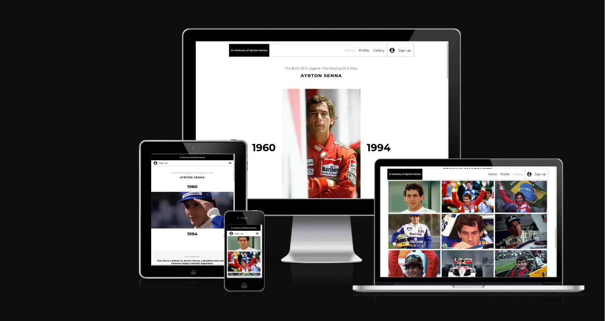
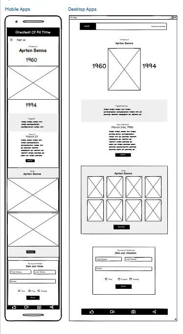
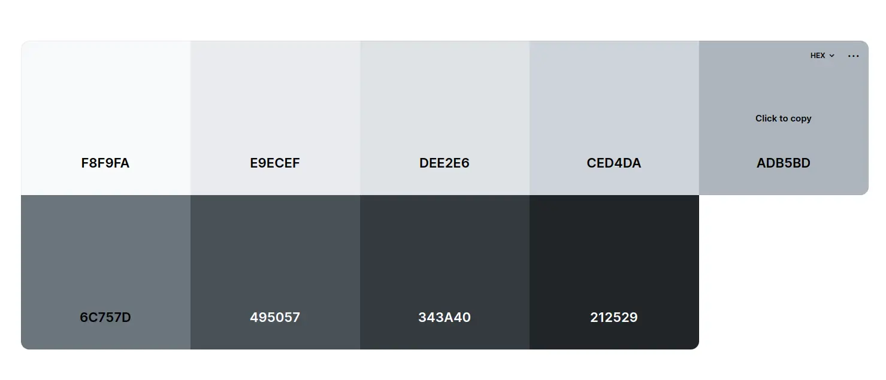
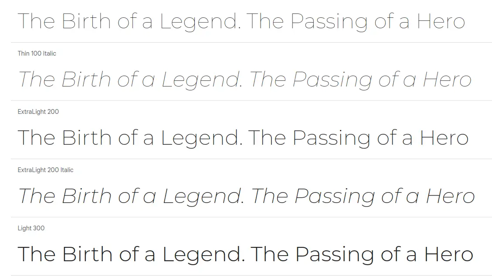
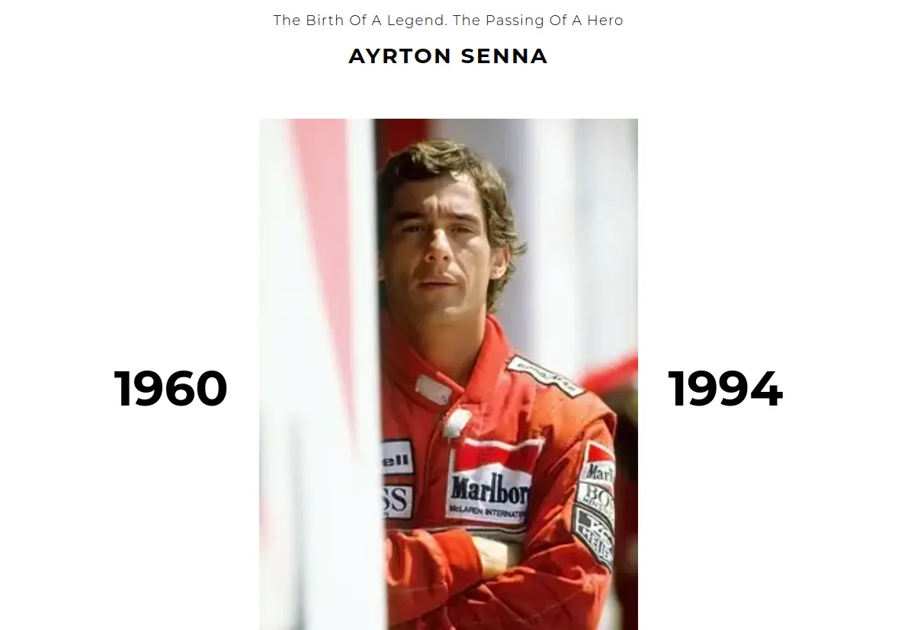
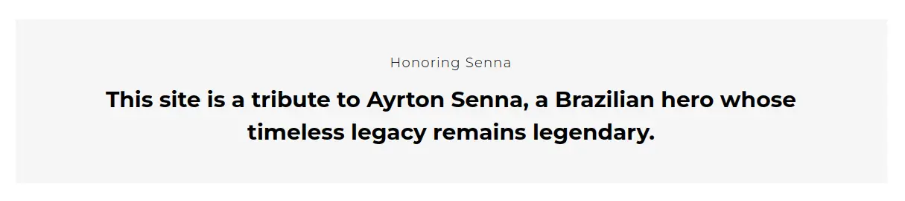
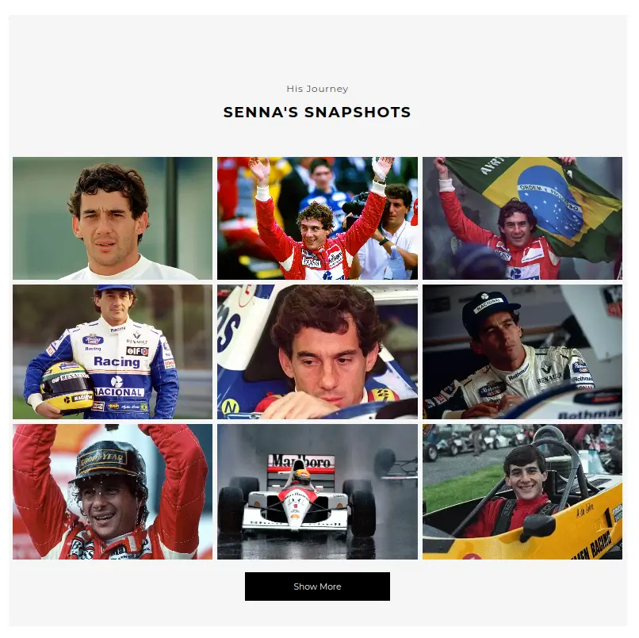
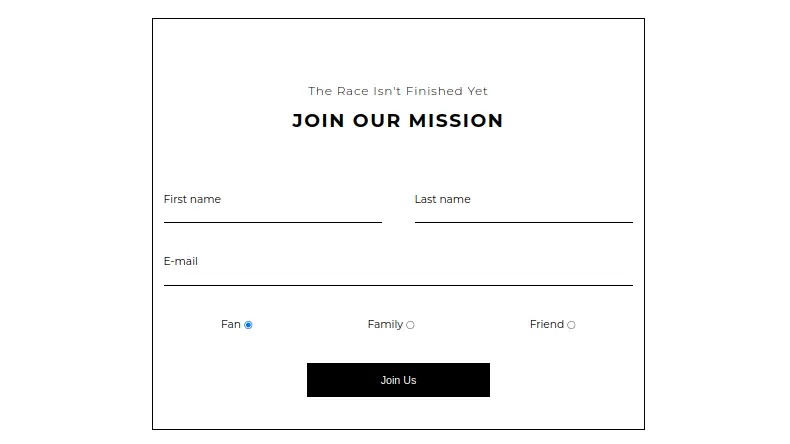

# Ayrton Senna Memorial

Ayrton Senna transcended the boundaries of motorsport with his exceptional skills, charismatic personality, and unwavering sportsmanship. The Brazilian F1 racing driver's illustrious career, highlighted by his three Formula 1 World Championships, represents only a fraction of his profound impact. Senna evolved into an enduring symbol of passion, dedication, and inspiration, captivating the hearts of motorsport enthusiasts and extending his influence far beyond the race track.

In honor of this remarkable hero, a beautifully crafted memorial website has been curated, offering a poignant tribute that befits his monumental stature. This memorial website stands as a testament to Senna's enduring legacy.

## Contents

[Planning & Development](https://github.com/mistersouza/ayrton-senna#planning--development)

[Features](https://github.com/mistersouza/ayrton-senna/README.md#feature)

[Testing](https://github.com/mistersouza/ayrton-senna/README.md/#testing)

[Deployment](https://github.com/mistersouza/ayrton-senna/README.md#deployment)

[Languages](https://github.com/mistersouza/ayrton-senna/README.md#languages)

[Software](https://github.com/mistersouza/ayrton-senna/README.md#software)

[Media](https://github.com/mistersouza/ayrton-senna/README.md#media)

[Credits](https://github.com/mistersouza/ayrton-senna/README.md#credits)

## Planning & Development

### Business Strategy

_These strategic pathways collectively validate the website's business relevance, as it not only pays homage to Ayrton Senna but also opens doors to a range of opportunities for growth and impact._

+ __Continued Brand Promotion and Sponsorship:__ Leverage Senna's iconic image for brand recognition and partnerships.

+ __Educational and Charitable Initiatives:__ Support educational and charitable initiatives tied to Senna's legacy.

+ __Motorsport Tourism and Event Promotion:__ Promote motorsport-related experiences and events for revenue generation.

### Audience

_The target audience for the above website would include:_

1. 

Motorsport Enthusiasts
 Users fans of Formula 1 and motorsport who admire Ayrton Senna and are interested in his career, achievements, and legacy.

2. 

History Buffs
Users with an interest in the history of motorsport and iconic racing figures like Ayrton Senna.

3. 

Inspiration Seekers
 Users looking for inspirational stories and life lessons from Ayrton Senna's journey to success.

4. 

Collectors and Memorabilia Enthusiasts
 Users interested in purchasing or collecting memorabilia related to Ayrton Senna, such as merchandise or rare artifacts.

5. 

Educational Institutions
 Users, including members of schools, colleges, and universities, who may want to utilize the website as an educational resource for sports history or leadership studies.

6. 

Tourists and Travelers
 Users visiting locations associated with Ayrton Senna, such as his hometown or places of significance in his life.

7. 

Sponsors and Marketers
 Users associated with brands or companies interested in aligning themselves with Ayrton Senna's legacy for marketing or sponsorship opportunities.

8. 

Charities and Nonprofits
 Users head of organizations aligned with Ayrton Senna's values and causes, seeking to collaborate or receive support.

9. 

Media and Journalists
 Users members of press and media outlets looking for information and stories related to Ayrton Senna for reporting or documentary purposes.

10. 

General Public
 Any user curious about Ayrton Senna's life, career, and impact, including those seeking to participate in community discussions or events related to his legacy.

### User Stories

_These user stories support the website's business strategy, ensuring an engaging and valuable experience for all target audiences._

+ __Business Partner Perspective:__ As user, I want to explore how I can associate my brand or company with Ayrton Senna's legacy for strategic marketing and sponsorship opportunities.
+ __Educational User Perspective:__ As user, I want to access comprehensive sports history and leadership studies resources available on the website, enhancing the learning experience for students and scholars.
+ __Racing Enthusiast Perspective:__ As user, I want to delve into Ayrton Senna's illustrious racing career, reliving his iconic moments and understanding his impact on the world of motorsports.
+ __Inspiration Seeker Perspective:__ As user, I want to explore how Ayrton Senna's life and principles continue to influence people from diverse fields, empowering them to strive for excellence.
+ __Community Engagement Perspective:__ As user, I want to contribute my personal stories and experiences related to Ayrton Senna, fostering a sense of community and shared appreciation for his legacy.

### Site Objectives

_These succinct objectives outline the website's core purposes and strategic focus._

1. 

Legacy Recognition
Elevate Ayrton Senna's global recognition and preserve his legacy.

2. 

User-Friendly
Create an engaging and clear website experience.

3. 

Event Promotion
 Inform about upcoming events and activities.

4. 

Charitable Support
Drive support for charitable causes linked to Ayrton Senna.

5. 

Inspiration Hub
Showcase Ayrton Senna's career and inspire new generations.

6. 

Industry Reference
Serve as a go-to EPK for motorsports professionals.

7. 

Exclusive Content
Offer unique media to enrich the user experience.

8. 

Community Growth
Expand the fanbase and foster community spirit.

9. 

Educational Resource
Provide valuable sports history and leadership studies material.

10. 

Audience Engagement
 Enable user subscriptions for updates and news.

### Approach

_The approach guarantees alignment with both business strategies and user stories, prioritizing a seamless and user-centric experience._

+ Present information logically based on research and planning.
+ Design the site with user experience principles in mind.
+ Offer users links to book tickets for events.
+ Provide map links for venue locations and the option to add gig dates to Google Calendar.
+ Grant access to exclusive media content, including embedded audio files, YouTube videos, and a photo gallery.
+ Ensure that the site's content is inoffensive and accessible to all.
+ Maintain easy navigation, intuitive design, and design consistency.
+ Include a subscription method for users to join a mailing list.

### wireframe

We've opted for Balsamiq software to design responsive layouts. These wireframes provide a clear site structure and organized content layout.

### Color Scheme

We've chosen a grayscale color scheme during the initial design phase to prioritize content structure and the user experience. Accent colors will be selected after conducting comprehensive UX research to ensure they effectively enhance the overall design and user interaction.

### Typography

We've opted for a single font family to maintain a sleek and uniform design foundation. However, our forward-looking strategy includes exploring custom fonts down the road. This exploration will come after conducting extensive UX research, refining our business objectives, and forging strong partnerships. Our aim is to enhance the website's uniqueness and user experience by selecting fonts that align seamlessly with our design and audience preferences.

+ Montserrat
  + Thin
  + Light
  + Italic
  + Regular
  + SemiBold
  + Bold

 

## Features

Check out the current site features as well as potential additions for the future

### Header

_The Header is responsive and always fixed at the top, ensuring it guides users seamlessly through all sections of the website._

+ Features navigation links
  + Each link offers a hover effect to give users visual feedback.
  + Every section has its dedicated active class, providing users with immediate feedback about their current location on the site.

[Header screenshot](assets/images/readme/memorial-header.webp)

### Hero

_The hero section is designed to clarify the subject and instantly convey the website's purpose to users_

+ This section offers two distinct images for various screen breakpoints.
                 

### Profile

_This section offers users insight into Ayrton Senna's life._

+ The link on the section opens the Wikipedia page in a new tab.

### Gallery

_This section highlights Ayrton Senna's genius behind the wheel._

+ The link on the section opens the Getty Images page in a new tab.

### Sing Up

_This section invites users to join the mission._

+ The form in this section will validate user input against HTML5 guidelines.

### Footer

_Last but not least, this section displays links to social networks._

+ The links open in new tabs and feature descriptive arial-label attributes to improve accessibility.

## Future Features

_This project is set to keep evolving as I go on on my developer path and forge partnerships along the way._

+ I'm in the process of beefing up the embedded script to make the website fully interactive_

## Deployment

_We pushed the site live on GitHub Pages._

+ check it out [here](https://mistersouza.github.io/ayrton-senna/)

## Languages

_Web trinity_

+ HTML
+ CSS
+ JS

